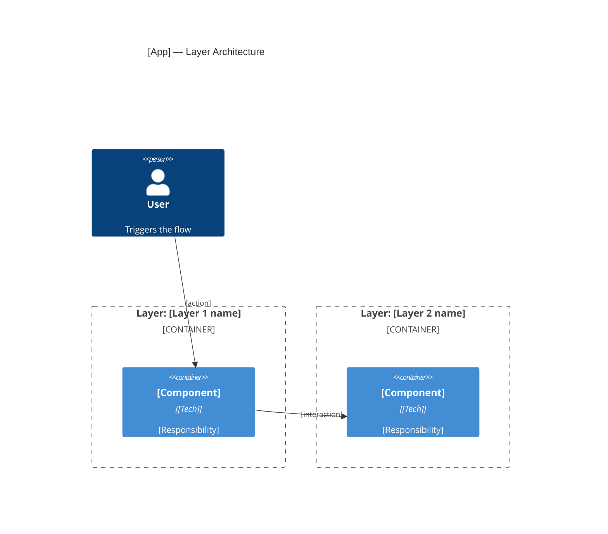
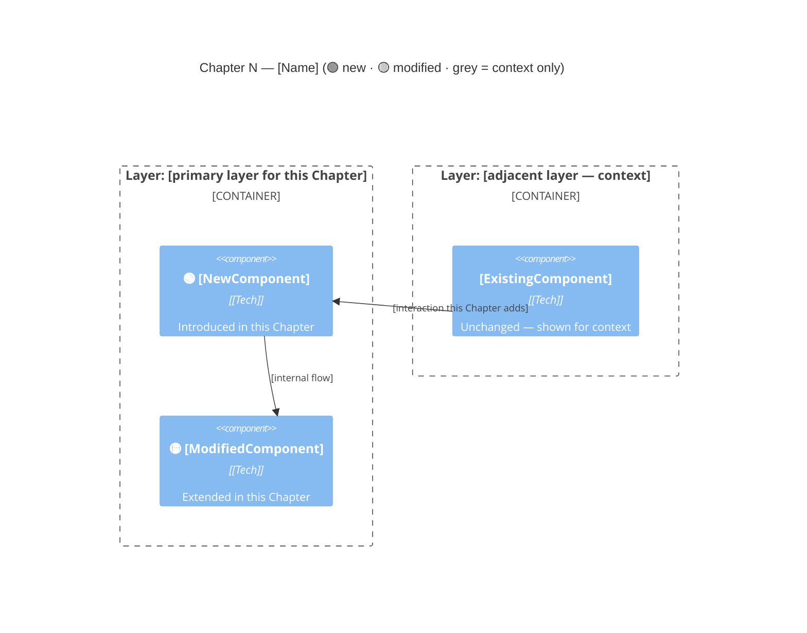
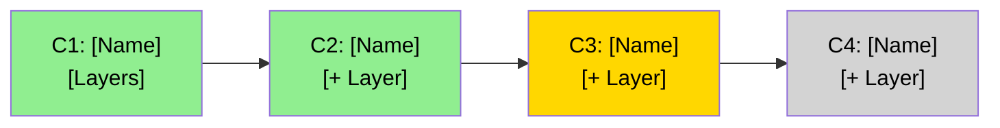

# Arc42Stories — Architecture Documentation Specification

**Version:** 0.1 (draft)
**Status:** Proposed — seeking community feedback
**Origin:** Extended from [arc42](https://arc42.org) by Gernot Starke & Peter Hruschka
**Maintainer:** Hortora

---

## Why this exists

[arc42](https://arc42.org) has been the gold standard for architecture documentation since 2005. It answers: *what is the system, how is it structured, and why were the key decisions made?*

Arc42Stories extends arc42 to answer three questions arc42 cannot:

1. **How is the system being built incrementally?** — delivery planning, Chapter sequencing, layer impact tracking
2. **How does an LLM pick up a session and know where to continue?** — living document structure fed by session journals
3. **How does an LLM in a completely different domain replicate the same architecture?** — Pattern to replicate per layer entry

These are not cosmetic additions. They reflect a fundamental shift in how software is built: iteratively, with LLM assistance, by teams that rely on structured documentation as shared memory across sessions. Arc42 was designed for a world where an architect wrote documentation once. Arc42Stories is designed for a world where documentation grows continuously alongside the system, serves as context for AI assistants, and enables any capable team to replicate the architecture in a new domain.

**Arc42Stories does not replace arc42.** It extends it. All 12 arc42 sections are preserved. Arc42Stories adds Journeys and Chapters as an evolutionary delivery layer, augments layer entries with replication and wiring knowledge, and defines a session lifecycle that keeps the document current.

---

## Diagrams — C4 Extension for Arc42Stories

Arc42Stories uses the [C4 Model](https://c4model.com) rendered as [Mermaid](https://mermaid.js.org). Mermaid renders natively on GitHub, works inline in `.md` files, and requires no external tooling.

Arc42Stories extends C4 with three view types that arc42 does not define. These sit alongside the standard C4 views.

---

### Standard C4 views (inherited from arc42)

| View | Mermaid type | Section |
|---|---|---|
| System Context | `C4Context` | §3 |
| Runtime scenarios | `C4Dynamic` | §6 |
| Deployment topology | `C4Deployment` | §7 |

---

### Arc42Stories C4 Extension

#### View 1 — Layer Architecture View (`C4Container`)

**Purpose:** shows all foundation layers as `Container_Boundary` groups. Reveals the horizontal stack — which components belong to which layer and how they relate.

**Used in:** §5 Building Block View (once, for the whole system).

````markdown

````

**Rules:**
- One `Container_Boundary` per layer. Label it `Layer: [name]`.
- Show only the components that exist in the current delivery state — add components as Chapters ship them.
- Relationships show the integration paths between layers, not internal detail.

---

#### View 2 — Chapter View (`C4Component`)

**Purpose:** filtered view showing only the elements a specific Chapter introduces or modifies. Makes the Chapter's Layer Impact table visual.

**Used in:** each §9.3 Chapter entry.

````markdown

````

**Rules:**
- 🟢 prefix on component name = new in this Chapter.
- 🟡 prefix = modified/extended in this Chapter.
- No prefix = existing, shown for context only. Omit if not needed for clarity.
- Keep to the elements the Chapter actually touches. Do not show the full system.
- Include one `Container_Boundary` per layer that this Chapter affects.

---

#### View 3 — Journey Map (Mermaid flowchart)

**Purpose:** shows how Chapters chain together across a Journey — delivery status, sequencing, and dependencies. This is a delivery planning view, not a runtime view, so a flowchart is used rather than `C4Dynamic`.

**Used in:** §9.1 Journey Overview.

````markdown

````

**Colour convention:**

| Status | Fill colour | Meaning |
|---|---|---|
| ✅ Complete | `#90EE90` (light green) | Chapter shipped |
| 🚧 In progress | `#FFD700` (yellow) | Chapter in active development |
| 🔲 Pending | `#D3D3D3` (light grey) | Chapter not yet started |

**Rules:**
- Each node label: Chapter number + name + layers touched (abbreviated).
- Arrows show sequential dependency or delivery order. Add a label when the dependency is non-obvious.
- One flowchart per Journey.

---

### Layout guidance

Mermaid's C4 auto-layout can be hard to control on large diagrams. Keep each diagram focused — one Chapter, one layer, or one flow. Prefer multiple small diagrams over one large one. For production-grade diagrams requiring precise layout control, [PlantUML + C4-PlantUML](https://github.com/plantuml-stdlib/C4-PlantUML) is the alternative.

---

## Core Concepts

| Term | Definition |
|---|---|
| **Journey** | A major user or business flow — the overarching story the application tells |
| **Chapter** | A vertical cut through the architectural layers delivering one user-visible capability end-to-end. Chapters are the planning and delivery unit. |
| **Layer** | A horizontal architectural concern — a technical tier, foundation module, or infrastructure component. Layers are the implementation unit. |
| **Delta** | The amount of change a Chapter introduces to a layer: `None` / `Low` / `Medium` / `High` |
| **Accountability gap** | A formal requirement — compliance, audit, or user-visible — not met before this Chapter ships |
| **Pattern to replicate** | Domain-agnostic numbered steps an LLM follows to implement the same layer in a different project |
| **Profile** | A domain- or stack-specific instantiation of Arc42Stories (e.g. CaseHub Profile, Spring Boot Profile) |
| **Project artifact schema** | A project-defined table mapping artifact types to their naming format — so cross-references throughout the document are unambiguous |

**Naming note:** "Chapter" is used deliberately rather than "slice" to avoid confusion with [Vertical Slice Architecture](https://jimmybogard.com/vertical-slice-architecture/) — a code organisation pattern where source code is co-located by feature. Chapters are a documentation and delivery planning concept, not a code organisation pattern. The metaphor is the same — a vertical cut through horizontal layers — but the domain is different.

---

## Project Artifact Schema

Every Arc42Stories document defines a small artifact naming schema — a table that maps artifact types to their naming format. Cross-references throughout the document use these formats. Any reader (human or LLM) can resolve a reference without ambiguity and without prior knowledge of the project.

Define the schema in §1 Introduction and Goals, immediately after the project description.

```markdown
## Artifact Schema

| Artifact type | Format | Example | Where it lives |
|---|---|---|---|
| Improvement log entry | `[PREFIX]-NNN` | `DT-042` | `docs/PROGRESS.md` |
| Issue / work item | `#NNN` | `#52` | GitHub Issues |
| Garden entry | `GE-YYYYMMDD-XXXXXX` | `GE-20260521-e39ad1` | `~/.hortora/garden/` |
| ADR | `ADR-NNNN` | `ADR-0007` | `docs/adr/` |
| Blog entry | `YYYY-MM-DD-title` | `2026-05-19-layer-5-lands` | `blog/` |
| Design spec | `YYYY-MM-DD-topic` | `2026-05-15-epic3-design` | `docs/specs/` |
```

**Rules:**
- The `PREFIX` in improvement log entries is project-specific. Choose a short, memorable abbreviation (e.g. `DT` for devtown, `AML` for AML, `CLI` for clinical). Use it consistently throughout the document.
- All other format columns are suggestions — projects may use whatever format their tooling produces. The schema table is the declaration; the document follows it.
- A Profile may define default schema conventions for its stack (e.g. the CaseHub Profile defines `GE-YYYYMMDD-XXXXXX` for garden entries).
- Any reference in the document that matches a defined format is a navigable cross-reference. LLMs reading the document use the schema to resolve references without asking.

---

## The Two Principles

### 1. Chapters are the delivery unit; layers are the implementation unit

A Chapter defines a user-visible capability and identifies which layers it requires. To deliver a Chapter: implement each required layer in turn, doing only what the Chapter needs from that layer, until the Chapter works end-to-end. Move to the next Chapter. Deepen a layer further only when a later Chapter requires more from it.

The layer ordering in §9.4 is for *reading* — the sequence a developer follows to understand the system. It is not the build sequence. Build sequence is governed by the Chapter plan.

### 2. Minimal delta sequencing

When sequencing Chapters, apply two criteria in order:

1. **Sequential dependencies first.** Some Chapters can only follow another because the earlier Chapter provides something the later one needs at runtime. Identify these hard constraints before sequencing.

2. **Minimal layer delta next.** Among unblocked Chapters, prefer the one that touches the fewest new layers. Smaller deltas mean smaller, more reviewable delivery steps.

Document soft orderings (Chapters that appear independent but produce artefacts the next one consumes) as rationale, not as blocking constraints.

---

## Document Structure

### §1 Introduction and Goals
*(standard arc42)*

What problem does this application solve? Who are the stakeholders? What are the top quality goals?

### §2 Constraints
*(standard arc42)*

Technical and organisational constraints — compliance requirements, platform dependencies, technology choices imposed externally.

### §3 Context and Scope
*(standard arc42 + C4 System Context diagram)*

System boundaries, external interfaces, and neighbouring systems. Include a C4 System Context diagram.

### §4 Solution Strategy
*(standard arc42, augmented with Chapter sequencing rationale)*

Fundamental decisions shaping the architecture. Include:

- Core architectural patterns and why they were chosen
- Layer taxonomy for this application (see Profiles)
- Journey and Chapter sequencing rationale — which Chapters must precede which, and why

**Chapter sequencing rationale format:**
```
- Chapter N before Chapter M: [hard dependency reason]
- Chapter N and Chapter P: [soft ordering or minimal-delta reason]
```

### §5 Building Block View
*(standard arc42 + C4 Container and Component diagrams)*

Static decomposition of the system. For Arc42Stories, tag each building block with its layer. C4 Component diagrams should use layer colouring to make the horizontal structure visible.

Define each layer and its responsibilities here. The layer taxonomy is stack-specific — see Profiles for pre-defined taxonomies.

### §6 Runtime View
*(standard arc42 + C4 Dynamic diagrams)*

Key behavioral scenarios showing how components interact at runtime.

### §7 Deployment View
*(standard arc42 + C4 Deployment diagram)*

Infrastructure, hosting, and deployment topology.

### §8 Crosscutting Concepts
*(standard arc42)*

System-wide patterns — security, observability, error handling, coding conventions. Reference external protocol documents rather than duplicating them here.

**Anti-patterns belong here.** Include a concise anti-patterns subsection covering the failure modes most likely when extending this system. Use Symptom → Cause → Fix format (consistent with Gotchas in §9.4). Do not merely reference an external document — if the anti-pattern matters, the content belongs here. A reader with only ARC42STORIES.MD in context will not follow external references.

---

### §9 Journeys and Chapters *(Core Extension)*

This section replaces arc42's §9 (Architecture Decisions), which moves to §10.

#### §9.1 Journey Overview

```markdown
| Journey | Description | Chapters | Status |
|---|---|---|---|
| [Name] | [One sentence] | [N] | In progress / Complete |
```

#### §9.2 Chapter Index

Navigable summary of all Chapters in delivery sequence. Link each Chapter name to its full entry in §9.3. Followed by the Layer × Chapter matrix and sequencing rationale.

```markdown
| # | Chapter | Journey | Layers touched | Delta summary | Status |
|---|---|---|---|---|---|
| 1 | [Name] | [Journey] | L1, L5 | High, High | ✅ |
| 2 | [Name] | [Journey] | + L2 | Medium | ✅ |
| 3 | [Name] | [Journey] | + L3 | Low | 🔲 |
```

**Layer × Chapter matrix**

Rows are Layers (reading order); columns are Chapters (delivery order). Cells show delta or `—`. Read across a row to see which deliveries touched a layer; read down a column to see which layers a chapter required.

```markdown
| Layer | C1 | C2 | C3 | C4 | C5 |
|---|---|---|---|---|---|
| L1 Domain Baseline | High | Low | — | — | — |
| L2 [name] | — | Medium | Low | Low | Low |
| L3 [name] | — | — | Low | — | — |
| L4 [name] | — | — | — | Medium | Low |
| L5 [name] | High | Low | Low | Low | Low |
| L6 [name] | — | — | — | — | Medium |
```

Layers that appear in every column are foundational — they bear cross-cutting responsibility. Layers with a single column entry are additive. Layers with many Low deltas after their introduction are stable; repeated Medium/High entries signal a boundary problem worth investigating.

**Sequencing rationale:**
- C1 before C2: [hard dependency — C1 provides X that C2 requires at runtime]
- C2 before C3: [soft ordering — C2 generates Y that makes C3 meaningful]
- C3 and C4 independent: [minimal delta — C3 adds one layer vs C4's three]
```

The sequencing rationale and matrix live here — adjacent to the Chapter Index — so a reader sees delivery order, layer coverage, and dependency reasoning in one place. §4 Solution Strategy summarises the overall approach; §9.2 holds the per-Chapter detail.

#### §9.3 Chapter Entries

One entry per Chapter, in delivery sequence. Chapter entries are **lightweight** — 10–20 lines. Detail (key files, wiring, gotchas, patterns, C4 component diagrams) belongs in §9.4 Layer entries, not here.

```markdown
### Chapter N — [Name]

**Journey:** [Journey] | **Sequence:** N of M | **Status:** ✅ / 🚧 / 🔲
**Delivered:** [date] | **Issues:** [refs] | **Blog:** [link]

**What this delivers**
[2–3 sentences: what the system can do end-to-end after this Chapter ships, that it
could not do before. Focus on the user-visible or compliance-visible outcome.]

**Accountability gaps closed**
- [Gap name] → [Layer that closes it]

**Layer Impact**
| Layer | Delta |
|---|---|
| [Layer name] | Low / Medium / High |
```

**Rules:**
- Navigation (`git log --grep`) lives in the Layer entry, not here — avoid duplication.
- C4 Component diagrams belong in the Layer entry for the layer introduced or most changed. Only include a Chapter-level diagram when a Chapter spans multiple layers and the cross-layer interaction is the point — not by default.
- Risks and technical debt go in §12, not per Chapter entry.
- If a Chapter maps 1:1 to a single Layer, the Chapter entry is a delivery summary only. The full architectural record is in the Layer entry.
- If a Chapter spans multiple Layers, the Layer Impact table is the cross-layer view that neither Layer entry alone can provide — keep it clear.

#### §9.4 Layer Entries

One entry per layer integrated, in reading order (learning progression — not delivery sequence). Layer entries complement Chapter entries: Chapters show *what was delivered and when*; layer entries show *how each integration was built and how to replicate it in another project*.

```markdown
### Layer — [Name]

**Participates in chapters:** C2, C3, C4, C5
**Architectural patterns:** [names from your architectural patterns reference — e.g. Hexagonal, Clean, DDD, Event-Driven, CQRS-lite, Strategy, Registry, Observer]
**Key protocols:** [governing rules and standards — e.g. flyway-migration-rules.md, module-tier-structure.md]
**Design refs:** [design specs, analysis docs, brainstorm outputs — separate from protocols; e.g. docs/specs/YYYY-MM-DD-topic.md §Section, docs/comparison-analysis.md §Phase]
**Issues:** [issue tracker refs]
**Navigation:** `git log --grep="#N" --oneline`
**Blog:** [session blog entry — e.g. blog/YYYY-MM-DD-title.md]
**Improvement refs:** [improvements identified during this layer's implementation — e.g. docs/PROGRESS.md §DT-001–006, GitHub label `improvement`, Jira filter]
**Completed:** [date or 🔲 pending]

#### What it adds
[Teaching narrative: what this layer introduces, what gap it closes relative to the
previous layer, contrast with the before state]

#### Accountability gaps closed

| Gap | What breaks without it | Closed by |
|---|---|---|

#### Key files
[Specific files created or modified for this layer, with a one-line description of
each. Not a code listing — a navigational index. An LLM uses this to locate the
right entry points immediately without scanning the codebase.]

- `path/to/File.java` — [what it is and what it does]
- `path/to/AnotherFile.java` — [what it is and what it does]

#### Key wiring
[Non-obvious configuration not visible in code or official documentation —
the HOW. The things that trip people up. Format: what it is, why it's needed,
where to set it.]

#### Architectural decisions
[Layer-specific decisions — the WHY. Why this approach rather than the alternatives
considered. Tradeoffs accepted. This is for decisions local to this layer; decisions
that span multiple layers or are cross-cutting go in §10.]

#### Pattern introduced
[The named, referenceable pattern this layer establishes — one line. E.g.
"@DefaultBean CDI displacement", "inner SPI composition via coordinator",
"YAML → schema model → canonical API three-layer case definition".
Used as a quick orientation anchor for readers and LLMs.]

#### Pattern anchor
[1-2 key reference points into the code: class name + method or file path.
Not a code listing — a pointer. An LLM finding the pattern in the codebase
starts here. E.g. `QhorusAmlInvestigator.dispatch()`, `pr-review.yaml §goals`]

#### Gotchas
[What went wrong; what would go wrong without prior knowledge.
Format: **Symptom** → Cause → Fix]

#### Pattern to replicate
[Domain-agnostic numbered steps an LLM follows to implement this same layer
in a different project. Written so that an LLM building in a completely
different domain can follow these steps without knowledge of the original domain.]

1. ...
2. ...
```

Mark pending sections with 🔲 and include a pointer to what will fill them (e.g. `🔲 at Chapter 3 close — blocked on [dependency]`).

---

### §10 Architectural Decisions
*(arc42's §9, moved here — sparse by design)*

Only decisions not captured inline elsewhere. Arc42's rule applies directly: if a decision belongs in a layer entry or Chapter entry, put it there. This section should be sparse — if it grows large, decisions have been placed in the wrong section.

### §11 Quality Requirements
*(standard arc42)*

### §12 Risks and Technical Debt
*(standard arc42)*

- Outstanding risks with mitigation
- Technical debt accumulated across Chapters
- Layer churn observations — layers modified by many Chapters may indicate a boundary problem

### §13 Glossary

Definitions of terms used in this document and in the domain.

---

## The Arc42Stories Document

The Arc42Stories document for an application is named **`ARC42STORIES.MD`** — all caps, at the project or workspace root, consistent with other prominent session-critical documents (`CLAUDE.md`, `HANDOFF.md`).

This naming makes the standard explicit: any reader seeing `ARC42STORIES.MD` immediately knows the document follows this specification.

---

## Session Lifecycle

`ARC42STORIES.MD` is a living document. It grows with the system across development sessions.

**Working document** (per epic or sprint): A `JOURNAL.md` or equivalent captures in-session reasoning, decisions made, and approaches rejected. This is ephemeral — it exists during the epic and is discarded after.

**Permanent record** (`ARC42STORIES.MD`): At epic close, two things are distilled from the working document:
1. What was built → Chapter entry and layer entry in §9 updated
2. Cross-cutting decisions → §10 if not captured inline

**Rule:** if something is worth remembering between sessions, it belongs in `ARC42STORIES.MD`. If it only mattered during the session, it belongs in the session narrative (blog, diary) or is discarded.

---

## Profiles

A **Profile** is a domain- or stack-specific instantiation of Arc42Stories. A Profile defines:
- The layer taxonomy for the target stack (replaces generic UI/Application/Domain/Persistence)
- Stack-specific protocols and conventions referenced from §8
- Example Journeys and Chapters for the domain

**Defining a Profile:**
```markdown
## Arc42Stories Profile: [Name]

### Layer Taxonomy
| Layer | What it represents | Typical Delta range |
|---|---|---|
| [Layer 1] | [Description] | Low–High |
| [Layer 2] | [Description] | Low–Medium |
...

### Conventions
[Stack-specific conventions for §8 Crosscutting Concepts]

### Example Journey and Chapters
[A worked example showing the profile in use]
```

**Available Profiles:**
- [Arc42Stories CaseHub Profile](arc42stories-casehub-profile.md) — CaseHub agentic harness applications
- *(More profiles welcome — contribute via Hortora)*

---

## Comparison with arc42

| Concern | arc42 | Arc42Stories |
|---|---|---|
| Static architecture description | ✅ §1–8, 10–12 | ✅ same sections |
| Delivery planning | ❌ | ✅ Journeys + Chapters (§9) |
| Layer × delivery intersection | ❌ | ✅ Chapter Layer Impact table |
| LLM session continuity | ❌ | ✅ living document + session lifecycle |
| LLM replication in new domain | ❌ | ✅ Pattern to replicate per layer entry |
| Non-obvious wiring knowledge | ❌ | ✅ Key wiring per layer entry |
| Known failure modes | ❌ | ✅ Gotchas per layer entry |
| Accountability / gap tracking | ❌ | ✅ Accountability gaps per Chapter |
| Minimal delta planning | ❌ | ✅ §4 sequencing rationale |

---

## References

- [arc42](https://arc42.org) — Starke & Hruschka, 2005–present
- [arc42 §9 — only decisions not described elsewhere](https://docs.arc42.org/section-9/)
- [C4 Model](https://c4model.com) — Simon Brown
- [Vertical Slice Architecture](https://jimmybogard.com/vertical-slice-architecture/) — Jimmy Bogard (distinct from Arc42Stories Chapters)
- [Arc42Stories CaseHub Profile](arc42stories-casehub-profile.md)
