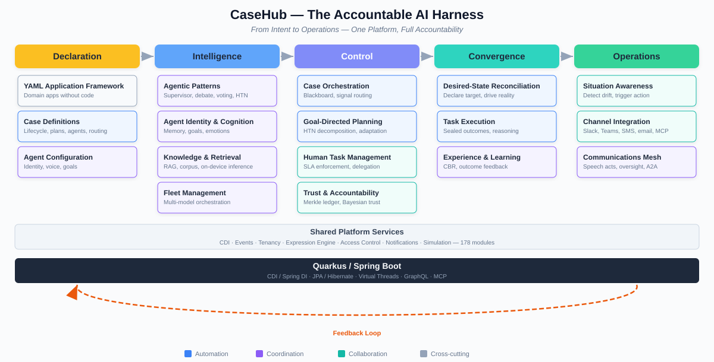
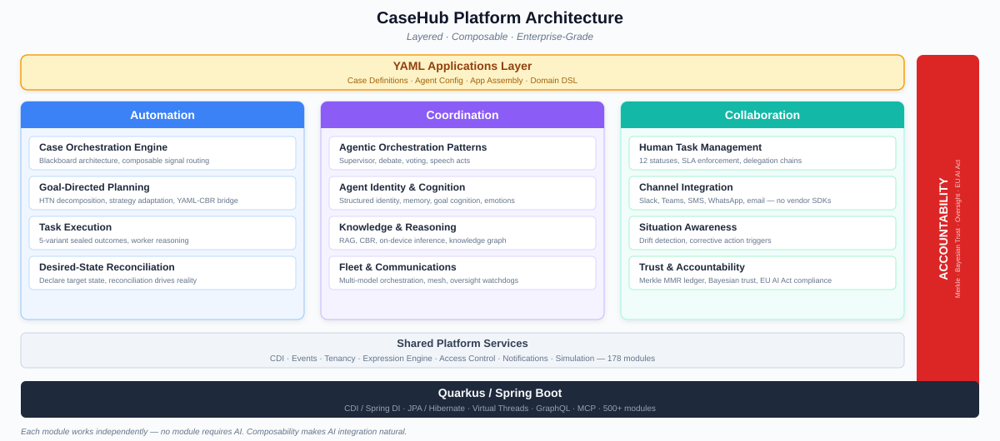

# CaseHub — The Accountable AI Harness

*From Intent to Operations — One Platform, Full Accountability*

Enterprise Automation, Coordination & Collaboration — Accountably — Through YAML.

AI agents that don't just execute — they reason, adapt, and leave a
tamper-evident trail of every decision.

Enterprise-class Java platform for AI-driven digital transformation.
Accessible through YAML. Accountable by design.

---

## The Problem

AI agents are powerful but uncontrolled. Today's agent frameworks let you
build demos fast — but they don't answer the questions enterprises need
answered:

- **Who decided what, and why?** No tamper-evident audit trail. No
  accountability chain. If an agent makes a consequential decision, you
  can't prove what happened.
- **How do you coordinate many agents?** Most frameworks handle one agent
  with tools. Real operations need fleets of agents, humans, and systems
  working together with speech-act protocols, trust scoring, and
  oversight gates.
- **How do you declare intent without writing code?** Domain experts
  understand the business problem. They shouldn't need to be Java
  engineers to express what they want.
- **How do you close the loop?** Automation that can't detect drift,
  trigger corrective action, and reconcile toward a desired state is just
  a script with extra steps.

## The Accountable AI Harness

CaseHub is an enterprise-class Java platform that channels and controls
AI power for digital transformation. It covers the complete lifecycle
from declaration to operations:

```
Declaration → Intelligence → Control → Convergence → Operations
     ↑                                                    │
     └────────────────── feedback loop ───────────────────┘
```

| Stage | What happens |
|-------|-------------|
| **Declaration** | Define intent in YAML — cases, agents, topology, bindings |
| **Intelligence** | AI agents execute with agentic patterns — supervisor, debate, voting, HTN planning |
| **Control** | Enterprise-grade execution with oversight gates, trust routing, and tamper-evident audit |
| **Convergence** | Desired-state reconciliation drives reality toward declared intent |
| **Operations** | Situation awareness detects drift and triggers corrective action |

The loop closes. Operations feeds back into Declaration. Situations
trigger new cases. The platform is self-correcting.

## Key Differentiators

### Breadth of Homogeneous Consistency

500+ modules across the foundation, every one sharing the same CDI
model, event system, type safety, tenancy model, and audit trail.
Capabilities compose without integration glue. This isn't bolted-together
best-of-breed — it's one coherent system.

### Written by LLMs for LLMs

The platform is AI-native by design. Every API, DSL, SPI, and MCP tool
is designed so that LLMs can effectively operate the platform. The
entire development process uses LLMs, and the platform is built for
LLM operability from the ground up.

### End-to-End Lifecycle

No competitor covers Declaration through Operations as one platform.
LangChain gives you Intelligence. Camunda gives you Control. Kubernetes
gives you Convergence. CaseHub gives you all five stages — declared in
YAML, executed on enterprise Java, with full accountability.

### Accountability by Default

Every agent decision produces a tamper-evident audit entry in a Merkle
MMR ledger. Trust is scored via Bayesian EigenTrust with exponential
decay. Oversight gates enforce M-of-N quorum approval for consequential
actions. EU AI Act Art.12 compliance evidence is generated automatically.
Privacy is structural — even erasure receipts are tamper-evident.

### Domain Portability

One platform, many verticals. The same engine runs anti-money laundering
investigations, clinical trial coordination, software development
automation, home automation with IoT devices, security operations, and
financial trading. Domain experts express their domain in YAML — the
platform provides the automation, coordination, and collaboration
infrastructure.

## Market Position

| | CaseHub | LangChain / CrewAI / AutoGen | Camunda / jBPM | Kubernetes |
|---|---|---|---|---|
| Lifecycle stage | All five | Intelligence only | Control only | Convergence only |
| Accountability | Structural (Merkle) | None | Audit log (appendable) | None |
| Agent coordination | Speech acts, trust routing, oversight | Tool calling | Service tasks | None |
| Accessibility | YAML + Java | Python | BPMN XML | YAML (infra only) |
| Domain portability | Any vertical | AI-specific | Process-specific | Infra-specific |

---

## Themes

### 1. Accountable by Default

Every agent decision produces a tamper-evident audit entry in a Merkle
MMR ledger. Trust is Bayesian with exponential decay — scored, not
assumed. Oversight gates enforce M-of-N quorum approval for
consequential actions. EU AI Act Art.12 compliance evidence is generated
automatically. Privacy is structural — even erasure receipts are
tamper-evident. Accountability isn't a feature — it's the architecture.

### 2. From Intent to Operations

The complete lifecycle loop: declare intent in YAML, agents execute with
enterprise controls, desired-state reconciliation drives reality toward
the declaration, situation awareness detects drift and triggers
corrective action. The loop closes — operations feeds back into
declaration. No competitor covers all five stages as one platform.

### 3. Learn, Adapt, Improve

Case-based reasoning drives a learning loop across the platform.
Execution outcomes feed back into routing decisions, plan adaptation,
and experience-based reasoning. Workers learn which approaches succeed
in which contexts. Routing signals incorporate historical performance.
Plans adapt based on prior case similarity. The platform gets better
with use — and this is proven and deployed, not theoretical.

### 4. Composable Standalone Architecture

Built on proven open-source primitives. Every module works independently
— the audit ledger, human task engine, communications mesh, and web
framework are each standalone products. No module requires AI. This
composability is what makes AI integration natural: agents participate
through the same SPIs as humans and systems. Customers adopt the pieces
they need today, and AI capabilities layer on without rearchitecting.
The platform isn't a bet on one AI trend — it's infrastructure that
outlasts any model generation.

### 5. Enterprise Depth, YAML Simplicity

500+ modules of enterprise Java underneath. Domain experts see YAML.
Agentic patterns — supervisor, debate, voting, HTN decomposition — are
declared as building blocks, not custom code. Hybrid execution controls
blend orchestration and choreography for coordination and collaboration.
The depth is the substance; YAML is the access layer.

### 6. Fully Automatable

Every part of the platform is automatable through GraphQL and MCP.
Distributed scripting capabilities enable end-to-end programmatic
control. Scenario and simulation frameworks are built in and consistent
throughout — not afterthoughts. The platform is its own best operator.

### 7. Cognitive Agents *(horizon)*

Structured agent identity with vocabulary-grounded descriptors and
subsumption matching. Goal cognition with 5-phase lifecycle. OCC
emotional model. Progressive attention. Personality calibration. This is
where the learning loop (Theme 3) leads when combined with agent memory
and behavioural signals — positioned as the trajectory, not a headline
claim. Research-grade, actively developed, not yet proven at scale.

---

## Platform Overview

### Lifecycle Arc



The complete lifecycle from declaration to operations. Each capability
area is positioned at its primary lifecycle stage and colour-coded by
pillar: **Automation** (blue), **Coordination** (violet),
**Collaboration** (teal). The feedback loop closes the arc — situations
detected in operations trigger new declarations.

### Architecture Stack



How the platform layers. YAML applications at the top, capability areas
organised by pillar in the middle, shared platform services underneath,
and the Quarkus / Spring Boot foundation at the base. The accountability
thread runs through every layer — not bolted on, structural.

