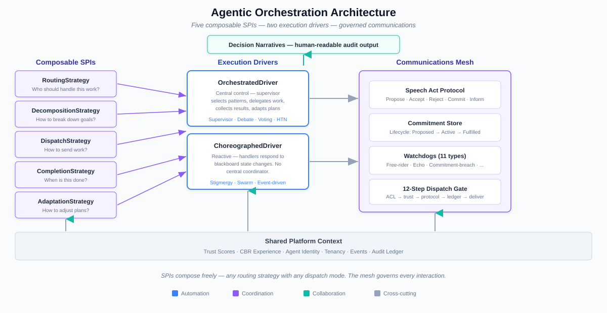

# Agentic Orchestration

*Orchestration that works without AI — and gets better when AI participates.*

---

## What It Is

Agentic orchestration in CaseHub is the machinery that coordinates
multiple agents, humans, and systems to accomplish work. It covers
everything from choosing who does what, to managing how agents
communicate, to tracking what they actually agreed on.

This is not a thin layer over LLM calls. It is deterministic
enterprise infrastructure — CDI-wired engines that schedule, route,
monitor, and record multi-agent work. LLMs are one strategy these
engines can invoke, not the decision-maker that holds them together.
A supervisor pattern, a voting round, a debate protocol — each runs
as mechanical infrastructure. The result is orchestration that is
auditable, reproducible, testable, and predictable. AI makes it
smarter; the machinery makes it reliable.

---

## Key Capabilities

### Composable Orchestration Patterns

Five independently composable SPIs — routing, decomposition,
activation, aggregation, and termination — combine to create
orchestration topologies. Eight patterns ship out of the box:
supervisor, sequence, loop, parallel, voting, debate, HTN
decomposition, and custom. All are expressible in both Java and
YAML.

The SPIs are independent. A voting topology uses one routing
strategy, one aggregation policy, and one termination condition.
Swap any of them without touching the others. A conversation can
transition from debate to voting to supervisor mid-stream because
the patterns compose at runtime, not at definition time.

Two execution drivers serve different coordination models:
OrchestratedDriver runs an imperative control loop; ChoreographedDriver
reacts to events on the shared blackboard. Both use the same SPI
contracts.

Decomposition strategies range from identity (no decomposition)
through GOAP backward-chaining to SHOP-style forward reasoning and
full HTN hierarchical task networks with DAG cycle validation —
all in the same framework.

### Agentic Communications Mesh

The communications mesh makes every agent interaction an accountable
speech act. Messages carry semantic obligations — a COMMAND creates
a commitment, a PROPOSE opens a negotiation, a DONE fulfils an
obligation. Ten message types rooted in speech act theory ensure
agents don't just exchange data; they enter into normative
relationships with enforceable outcomes.

The commitment store tracks obligation lifecycle from OPEN through
ACKNOWLEDGED to terminal states (FULFILLED, FAILED, DECLINED,
DELEGATED, EXPIRED). Automatic deadline enforcement ensures nothing
is silently dropped. Twenty-nine store interfaces back the full mesh
state — channels, commitments, messages, summaries, reactions,
presence, membership, protocols, watchdog conditions.

A 12-step dispatch gate pipeline enforces policy on every message:
paused check → ACL → rate limiting → capability routing → trust gate →
type policy → correlation integrity → protocol evaluation →
enforcement gate → overwrite → ledger → fan-out. There is no bypass
path. Every message passes through every gate.

Protocol enforcement is pluggable. Four built-in protocols
(REQUEST_RESPONSE, TASK_COMPLETION, ROUND_ROBIN,
CONTRIBUTION_REQUIRED) with three enforcement modes — advisory
(log violations), blocking (reject violations), quarantine (hold
for review). Channels can adopt or switch protocols at runtime.

Eleven watchdog condition types detect coordination pathologies
before they cause harm: barrier stuck, approval pending, agent stale,
channel idle, queue depth, context pressure, loop detected,
obligation fan-out, conversation stall, echo chamber, circular
delegation. The platform doesn't just record what happened — it
actively monitors for dysfunction.

### A2A Protocol Bridge

CaseHub's communications mesh is not a closed system. The A2A
(Agent-to-Agent) protocol bridge provides Google A2A-compatible agent
discovery, task messaging, SSE streaming, and push notifications.
Agent cards are JWS-signed for verifiable identity.

This positions CaseHub as an open ecosystem participant — agents
within CaseHub can interoperate with A2A-compatible agents on other
platforms through the same normative accountability guarantees that
govern internal communication.

### Agent Mesh Primitives

Two mesh layout patterns structure how agents participate:

- **NormativeChannelLayout** — four-channel architecture: broadcast,
  coordination, task, and oversight. Full normative accountability
  with protocol enforcement on every channel.
- **SimpleLayout** — two-channel architecture: broadcast and task.
  Lighter governance for simpler coordination patterns.

Mesh participation strategies determine how agents enter, contribute
to, and exit coordinated work — the same agent can participate in
multiple meshes simultaneously with different roles.

### Conversation Protocol & Epistemic Common Ground

Multi-agent conversations get formal structure. ConversationProjection
folds channel messages into ConversationState. Epistemic common ground
analysis tracks what agents actually agree on versus what they dispute
— using three epistemic rules: explicit acknowledgement, tacit
acceptance, and commitment resolution.

Convergence detection classifies conversations across five states:
PROGRESSING, NARROWING, STABILISING, CONVERGED, and DEADLOCK. This
is not "max iterations reached" — it is formal convergence analysis
that enables adaptive conversation management. A debate that enters
DEADLOCK can trigger escalation. A negotiation that reaches CONVERGED
can auto-close.

The negotiation protocol supports bilateral and multilateral
negotiation with acceptance policies (unanimous, majority, threshold).
An autonomous conversation orchestrator with pluggable turn policies
(round-robin, addressed, point-addressed, free) manages multi-agent
dialogue without manual intervention.

### Decision Narratives

Raw platform signals — trust scores, routing weights, CBR matches,
personality dispositions — are opaque to humans. The decision
narrative pipeline transforms them into human-readable accountability
explanations.

Two-level processing: heuristic L1 generates structured summaries
from signal data; LLM L2 produces natural language explanations when
needed. The result is a reusable explanation of *why* a particular
agent was selected, *why* a particular plan was chosen, *why* a
conversation was escalated. Accountability as infrastructure, not
afterthought.

### Temporal Event Summarisation

Multi-level event accumulation with configurable window policies,
compactors, and pluggable summarisers. Content summarisation routes
through three tiers: verbatim (for short windows), grouped (for
medium windows), and LLM-generated (for large volumes). Stateful
emission policies with write-through caching ensure consistent
summaries across sessions.

Keyed variants enable per-entity summarisation — each agent, each
case, each channel can maintain independent summary state. Five
documented summarisation patterns cover common use cases.

### Prompt Optimisation

Automated prompt improvement as reusable framework. Instruction
optimiser generates prompt variants using LLM reasoning. Few-shot
optimiser selects examples with configurable diversity strategies.
Variant store persists candidates. Outcome-aware selection promotes
variants that produce better results.

Runtime integration via VariantAwareSystemPromptCustomiser means
prompt improvements deploy automatically — no manual intervention,
no redeployment.

### Trust Intake & Vouching

Classification of new entities entering the system and managed
vouching between trusted entities. IntakeClassifier SPI evaluates
newcomers. VouchService SPI enables social vouching with
VouchConstraints enforcing eligibility rules. Trust signals compose
with the ledger's Bayesian trust scores and the engine's routing
policies — trust is not a number, it is a signal in a composable
routing decision.

### Capacity-Aware Routing

Agents are routed away from overloaded channels automatically.
Commitment-count capacity sources track per-channel load in real
time. Per-channel capacity thresholds trigger redistribution when
an agent's commitment count exceeds its budget. A redistribution
executor rebalances work across available agents. MCP tools expose
capacity state for operational visibility and manual override.
Capacity routing composes with trust routing and CBR routing — the
system considers load alongside trustworthiness and historical
performance when making dispatch decisions.

### Broadcast Channels

BROADCAST is a first-class channel semantic alongside direct and
group channels. `BroadcastMembershipManager` automatically adds and
removes participants as their capabilities change — agents join
broadcast channels for topics they can handle and leave when they
can't. `NotificationChannelBackend` bridges broadcast channels into
the platform's notification pipeline, enabling subscription-based
delivery (digest, suppress, immediate) for broadcast messages.

### Stigmergic Coordination (Hive Mind)

A fundamentally different coordination paradigm. Stigmergy — from
Greek *stigma* (mark) + *ergon* (work) — is coordination through
environment modification. Agents don't communicate directly; they
observe and modify a shared environment, and coordination emerges
from their individual reactions to environmental changes. The
canonical example is ant pheromone trails.

Six implemented foundation SPIs power the model:

- **Signal/Pheromone Model** — `SignalRegistry`, `SignalSpace` with
  temporal signals that decay and reinforce over time. Cross-case
  signal visibility via RAS pheromone CloudEvent bridge.
- **Environment Observation** — `EnvironmentObserver`,
  `ObservationRegistry` for agents to perceive CaseContext patterns.
- **Dynamic Interest Registration** — `InterestSpace`,
  `InterestDeclaration` for runtime observation interest management.
- **Agent Discovery & Neighbors** — `NeighborSpace` for emergent
  topology from shared activity. Agents discover each other through
  co-participation, not configuration.
- **Local Rule Evaluation** — `RuleSpace`, `RuleRegistry`,
  `LocalRule` for per-agent condition→action rules that drive the
  perceive→decide→act cycle.
- **Convergence Detection** — `ConvergenceDetector`,
  `BudgetEnforcer`, `ActivityTracker` for emergent termination.
  The swarm knows when it's done without a central coordinator.

The `StigmergyExecutionModel` composes all six SPIs into a coherent
coordination model — a case author declares `type: stigmergy` and
gets environment-aware swarm coordination with automatic convergence
detection. The `SwarmExecutionModel` extends this with self-selected
routing, self-provisioning, and behavioral fingerprinting.

Workers access all facets through domain-organized APIs on
`WorkerRuntime`: `signals()`, `interests()`, `neighbors()`,
`rules()`.

No competitor offers stigmergic coordination as a built-in
execution model alongside traditional orchestration patterns.

### Structured Chat Platform

The communications mesh extends into a full chat infrastructure
stack. The platform's `ChatPlatform` SPI (10 capability interfaces
including Messaging, Threading, Reactions, Typing, Presence, Search,
Pinning, Polls, Scheduling, Attachments) provides a uniform chat
surface across Slack, Discord, Teams, email, and custom providers.
Qhorus speech acts layer on top — every chat message is a normative
commitment, not just text. The chat-app workbench provides a
browser-based qhorus UI with WebSocket protocol (7 datasets),
H2/PostgreSQL persistence, and full lifecycle integration.

---

## What Makes It Different

### Mechanical Infrastructure, Not LLM Reasoning

This is the fundamental architectural difference between CaseHub and
LLM-centric frameworks like LangChain4j, CrewAI, and AutoGen.

In LLM-centric frameworks, the orchestration *is* the LLM. A
supervisor pattern works by asking the LLM "which agent should
handle this?" A routing decision works by prompting the LLM to
evaluate candidates. The framework provides glue code; the LLM
provides the intelligence. Every orchestration decision passes
through the LLM.

In CaseHub, orchestration is deterministic machinery. A supervisor
pattern is a CDI-wired engine that evaluates routing signals,
applies composition weights, and dispatches work — all without
touching an LLM. The routing decision blends trust scores, workload
metrics, CBR experience, personality dispositions, and semantic
embeddings through weighted composition. An LLM-based routing
strategy is one option — one signal provider among five.

This is not a philosophical distinction. It has concrete consequences:

- **Auditable.** Every routing decision is a weighted sum of typed
  signals. You can inspect, replay, and explain it without
  re-running an LLM prompt.
- **Reproducible.** Given the same signal values, the same routing
  decision occurs. No stochastic variation.
- **Testable.** Orchestration patterns can be unit-tested with
  deterministic signal values. No LLM mock required.
- **Predictable cost.** Orchestration decisions do not consume
  LLM tokens. You pay for AI work, not for the machinery that
  coordinates it.
- **Resilient.** If the LLM provider is down, orchestration still
  runs. Mechanical strategies degrade gracefully; LLM strategies
  fail gracefully.

LLMs participate when their reasoning adds value — routing decisions
that benefit from semantic understanding, decomposition strategies
that need creative planning, summarisation that requires natural
language generation. But the framework doesn't depend on them.
Orchestration that works without AI, and gets better when AI
participates.

### Normative Communication, Not Fire-and-Forget

LangChain4j, CrewAI, and AutoGen exchange messages. CaseHub's agents
enter into speech-act-grounded commitments with obligation tracking,
protocol enforcement, and tamper-evident audit. No competing framework
tracks what agents are *obligated* to do versus what they *said*
they would do.

### Epistemic Common Ground Is Novel

No competing framework tracks what agents actually agree on versus
what they dispute. Convergence detection as formal analysis — not
"max iterations" — enables adaptive multi-agent conversations that
respond to their own progress.

---

## How Deep It Goes

The orchestration framework is not a proof of concept. It is
production infrastructure with substantial depth:

**Blocks** — 25 modules, 903 Java source files. Ten capability
areas: compositional orchestration, BDI agent intelligence,
structured conversation protocol, temporal summarisation, social
cognition (90+ types), AI-powered routing, prompt optimisation,
agent memory hygiene, trust intake, speech pipeline.

**Communications mesh (Qhorus)** — 23 modules, 29 store interfaces,
30 SPI interfaces, 12-step dispatch pipeline, 1,035+ tests,
55-chapter ARC42STORIES architecture document.

**Engine orchestration** — 68 modules (44 non-example), 5 routing
signal providers, 6 worker function handlers, 2 execution drivers,
15+ extension SPIs, REST API with 20+ endpoints plus GraphQL.

**Patterns and topologies:** 8 pattern builders, 9 decomposition
strategies (identity through GOAP and HTN), 4 routing strategies
plus LLM-selected, 4 termination conditions plus judge convergence.
Every pattern available in Java DSL and YAML.

**Conversation infrastructure:** 27 conversation types, 5
convergence states, 3 epistemic rules, 4 turn policies, bilateral
and multilateral negotiation with acceptance policies.

**Watchdog monitoring:** 11 condition types. The system does not
just log — it detects dysfunction patterns (echo chambers, circular
delegation, conversation stalls) and raises alerts.

---

## What It Gains from the Platform

Orchestration patterns do not operate in isolation. Because every
capability shares one CDI context, one tenant model, and one event
system, the orchestration machinery has full platform context
available at every decision point:

- **Trust scores** from the ledger feed routing decisions directly.
  No API call — they share CDI scope.
- **CBR experience** from neocortex provides evidence-based routing
  and plan selection. Pattern retrieval queries run against the same
  data model.
- **Agent identity** from eidos provides personality dispositions
  for disposition-aware routing. Drive modulation uses descriptor
  weights.
- **Case lifecycle events** fire as CDI events — ledger, qhorus,
  and work react without coupling.
- **Expression engines** delegate to the platform's
  ExpressionEngineRegistry — the same JQ/MVEL/JEXL expressions work
  in bindings, routing rules, and orchestration conditions.
- **Tenancy** is enforced at every layer through the shared
  CurrentPrincipal model.

In a bolted-together system, wiring trust scores into routing
decisions would require API calls, data mapping, and integration
glue. In CaseHub, it is a signal provider that reads a CDI-scoped
bean. The integration cost is zero because there is nothing to
integrate — everything is already in the same context.

---

## Connections to Other Areas

- **→ Declaration Surface** — orchestration patterns are expressible
  in YAML. Case definitions declare which patterns to use, which
  agents to involve, and how routing should work.
- **→ AI Knowledge & Learning** — CBR provides experience-based
  routing and plan adaptation. RAG provides semantic embeddings for
  the semantic routing signal provider.
- **→ Enterprise Execution** — the engine consumes orchestration
  patterns via the blocks adapter. ExecutionModel, ExecutionDriver,
  and AgentRef flow from blocks to engine.
- **→ Accountability & Governance** — the communications mesh
  produces tamper-evident audit entries for every message.
  LedgerExecutionListener records EU AI Act Art.12 compliance events
  for orchestration decisions.
- **→ Agent Identity & Cognition** — social cognition types (mood,
  drives, narrative, emergence) render as PromptSections during
  orchestration. BDI beliefs and intentions drive decomposition
  and termination decisions. Disposition-aware routing uses eidos
  agent descriptors.
- **→ The Shared Foundation** — platform event system, expression
  engines, identity model, and agent infrastructure underpin every
  orchestration pattern.

---

## Architecture

*Five composable SPIs drive pattern execution. The communications
mesh enforces normative accountability on every agent interaction.
Trust, CBR, and identity signals flow in from the shared platform
context. Decision narratives flow out for human-readable
accountability.*

---

*For the complete capability and feature inventory, see Appendix A.*
