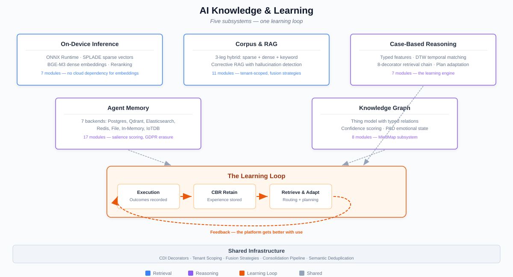

# AI Knowledge & Learning

*Agents that remember, reason from experience, and get better with use.*

Every AI platform offers retrieval and inference. CaseHub goes further:
execution outcomes feed back into routing decisions, plan adaptation,
and experience-based reasoning across the entire platform. Workers learn
which approaches succeed in which contexts. Plans adapt based on prior
case similarity. This isn't a research prototype — it's proven,
deployed, and measured.

---

## The Learning Loop

The CBR learning loop is the thread that runs through CaseHub's AI
capabilities. It connects retrieval, execution, and improvement into a
continuous cycle:

```
  Execute task
       │
       ▼
  Record outcome ──→ Outcome feedback
       │                    │
       ▼                    ▼
  Update case store    Adjust confidence
       │                    │
       ▼                    ▼
  Next similar task ←── Weighted retrieval
       │
       ▼
  Adapt plan from prior experience
       │
       ▼
  Execute adapted plan
       │
       └──→ (cycle continues)
```

This loop operates at three levels:

1. **Routing** — composable signal routing uses CBR experience scores
   alongside trust, workload, personality, and semantic signals to
   select the best worker for each task. Past outcomes directly
   influence future assignments.

2. **Plan adaptation** — when a new case resembles a prior one, the
   CBR plan adapter transforms the retrieved plan for the new context.
   The ensemble analyzer synthesizes consensus from multiple adapted
   plans when several prior cases are relevant.

3. **Experience reasoning** — retrieved cases carry their full context:
   the features that matched, the plan that was applied, the outcome
   that resulted, and the confidence that accumulated. Agents reason
   over this context, not just similarity scores.

The loop crosses repository boundaries transparently. A routing decision
in the engine uses trust scores from the ledger, personality signals
from eidos, and experience scores from neocortex — all evaluated in one
weighted composite because they share the same CDI context and data
model.

---

## Key Capabilities

### RAG Pipeline

Three-leg hybrid search combining dense embeddings, sparse SPLADE
vectors, and BM25 keyword matching. Most RAG implementations use one
or two retrieval legs. The third leg — BM25 — catches keyword matches
that embedding similarity misses, particularly for domain-specific
terminology, identifiers, and proper nouns.

**Retrieval pipeline:**
- Configurable fusion strategies (Reciprocal Rank Fusion, Distribution-
  Based Score Fusion, Convex Combination) with per-query weight
  multipliers
- Cross-encoder reranking after fusion for precision
- Corrective RAG quality-gating — grades chunks via cross-encoder
  before returning, rejecting low-quality matches
- Query expansion (HyDE, step-back, multi-query) for recall improvement
- Multi-corpus retrieval with per-corpus error isolation
- Matryoshka dimension reduction for storage efficiency

**Corpus management:**
- Pre-ingestion dedup gate — cosine similarity check before indexing
  prevents corpus bloat
- Apache Tika integration for binary document parsing (PDF, DOCX, etc.)
- Tenant-isolated Qdrant vector stores
- Retrieval tracking with feedback for analytics

**Analytics:**
- RetrievalAnalyzer: document impact scoring, query cluster detection
  (MinHash LSH), correlation graphs — pure computation analytics over
  tracking data
- ColBERT relevance evaluation with automatic calibration from sample
  score distributions

**Extent:** 11 modules. Full LangChain4j pipeline integration with
CaseHub tenancy isolation.

### Case-Based Reasoning (CBR)

Typed feature-vector similarity search over prior cases with outcome-
weighted learning. Unlike pattern matching or rule engines, CBR reasons
from actual experience — prior cases that succeeded or failed inform
current decisions.

**Feature system:**
- 7 typed feature value types (String, Numeric, Boolean, DateTime,
  Struct, StringList, StructList) with 9 field types (Categorical,
  Ordinal, Continuous, Discrete, Boolean, DateTime, FreeText,
  TimeSeries, DiscreteSequence)
- Dynamic Time Warping (DTW) similarity with O(n) LB_Keogh lower-bound
  pruning — handles time series of different lengths and temporal
  alignments
- Edit distance similarity for discrete sequences (plan steps, action
  chains, event traces)
- Not string-only matching — typed features enable domain-specific
  similarity that understands the semantics of each field

**Retrieval and adaptation:**
- Trust-weighted retrieval modulates similarity scores by source agent
  trust and trajectory via `AgentTrustProvider` SPI — bridging directly
  to the ledger's Bayesian trust model
- Temporal decay — older cases contribute less, configurable per domain
- Hierarchical scoping — `AllInDomain` scope fans out across all
  collections matching a domain prefix for cross-domain retrieval
- Plan adaptation pipeline: `CbrPlanAdapter` transforms retrieved plans
  for new contexts, `CbrPlanEnsembleAnalyzer` synthesizes consensus from
  multiple adapted plans
- Outcome feedback with EMA (Exponential Moving Average) confidence
  adjustment — cases that lead to bad outcomes decay automatically

**Lifecycle:**
- Supersession model — cases can be superseded (with documented reason)
  and reinstated, maintaining full audit trail
- Domain-specific guides: AML, Clinical, DevTown, IoT, Life, Engine —
  each with tailored feature schemas tuned to their domain

**Extent:** 7 dedicated modules plus shared memory-api. CDI decorator
chain (8 decorators from priority 90 down to 45): trend enrichment →
scope decay → temporal decay → outcome weighting → trust weighting →
tracking → erasure notification. JPA, in-memory, and Qdrant backends.
SQLite-backed retrieval, adaptation, and ensemble tracking. 164-test
contract test suite.

### On-Device Inference

Standalone ONNX inference layer for the JVM. Runs NLI, classification,
regression, reranking, sparse embeddings, and tensor operations locally
— no external API calls, no network latency, no data leaving the
deployment.

This fills a gap that LangChain4j leaves open: LangChain4j handles
dense embeddings via remote APIs but has no on-device NLI,
classification, regression, or SPLADE sparse embedding support.

**Capabilities:**
- Sealed `InferenceInput` hierarchy (Text + Tensor variants) with typed
  task adapters — callers never touch raw tensors
- BGE-M3 multi-modal embedder produces dense + sparse + ColBERT vectors
  from a single ONNX model run
- SPLADE sparse embedding generation for hybrid search
- Cross-encoder reranking for RAG precision
- NLI (Natural Language Inference) for entailment checking
- Classification and regression for content analysis
- Native image compatibility validated (GraalVM C2 gate passed)

**Extent:** 7 modules (api, runtime, tasks, splade, bge-m3, inmem,
quarkus). 5 typed task adapters. Full ONNX Runtime JNI + HuggingFace
Tokenizers JNI integration. Zero domain dependencies — shared with
non-CaseHub projects, ArchUnit-enforced.

### Agent Memory

Queryable, permission-aware, persistent agent memory with confidence-
based retention. Not just a key-value store — a structured memory
system that understands what's important, what's fading, and what
must be forgotten.

**Ordering and retention:**
- Salience ordering: recency × confidence scoring — not just "most
  recent" or "most similar"
- Confidence-based retention scheduling — low-confidence memories
  purge automatically
- Fire-and-forget emission via `MemoryEmitter` — error isolation,
  only SecurityExceptions propagate

**Storage backends (7):**
- In-memory (testing and lightweight deployments)
- JPA/PostgreSQL with full-text search
- SQLite with FTS5
- Mem0 (vector-based memory)
- Graphiti (temporal knowledge graph)
- Qdrant (vector similarity)
- Spring JPA (Spring Boot deployments)

**Privacy:**
- Cross-tenant entity erasure — GDPR Article 17 compliance across
  tenant boundaries
- `Subject` bridge for cross-store entity references without module
  coupling
- Erasure events propagate to CBR and knowledge graph stores

**Extent:** 17 modules spanning CDI and Spring frameworks. Contract
test suites for all store implementations.

### Knowledge Graph (MindMap)

Entity-centric knowledge graph with a dynamic type system, confidence-
aware nodes, emotional dimensions, and temporal validity. Unlike rigid
ontology systems, the Thing model lets LLMs discover and create new
entity types at runtime.

**The Thing model:**
- `Thing` interface as universal entity base — identity, properties,
  traits, dynamic type checking via `is()`/`as()`
- `as()` creates JDK Proxy mapping interface method names to property
  lookups — zero-boilerplate typed access to graph entities
- Types are dynamic strings stored in graph nodes, not a fixed enum —
  new entity types emerge from agent interaction
- `TypeRegistry` stores type hierarchy as graph data — type operations
  ARE graph traversal

**Cognitive extensions:**
- `MindMapNode extends Thing` with confidence (origin + decay), PAD
  emotional dimensions, temporal validity, provenance tracking
- Consolidation pipeline: attention tracking → merge detection →
  community summaries → curiosity refresh
- Derived edge rules: declarative YAML rules for automatic relationship
  inference
- Schema validation advisory — documents expectations without rejecting
  novel properties

**Built-in traits:** Personable, Projectlike, Organisational, Eventlike
— common entity patterns as reusable trait interfaces.

**Extent:** 8 modules (api, core, inmem, intelligence, spring, sqlite,
testing, main). 72-test contract test suite.

### Knowledge Consolidation Pipeline

Automatic maintenance of the knowledge graph through a multi-phase
background pipeline: conversation extraction → scheduling →
merge detection → community summaries → access-frequency tracking.
Five phases landed. The knowledge graph doesn't just grow — it
self-maintains, deduplicates, and surfaces community structure
from accumulated entries.

### Experience Consolidation

Bridges episodic experience events (Tier 2 memory) into the
knowledge graph (Tier 3). Agents graduate lived experience into
structured knowledge — patterns discovered during case execution
become permanent graph entries that inform future reasoning.
This completes the three-tier memory model: raw events → episodic
memory → structured knowledge.

### Cognitive Schema Flywheel

A self-reinforcing loop: schema discovery → pattern recognition →
improved extraction → richer schemas. The knowledge system improves
its own extraction capabilities over time. Each round of extraction
reveals new patterns that become templates for future extraction.
The knowledge infrastructure gets better at learning, not just at
storing what it's learned.

---

## What Makes It Different

### vs LangChain / LangChain4j

LangChain provides RAG and tool-calling infrastructure. CaseHub
provides that AND the learning loop that makes it improve. LangChain's
RAG is stateless — each query starts fresh. CaseHub's CBR remembers
what worked, what failed, and why. LangChain has no on-device inference,
no typed feature similarity, no plan adaptation, no outcome feedback.

### vs Vector-only retrieval (Pinecone, Weaviate, ChromaDB)

Vector databases provide storage and similarity search. CaseHub layers
3-leg hybrid retrieval, corrective quality gating, trust-weighted
scoring, outcome feedback, and cross-domain retrieval on top. The
difference is between "find similar documents" and "find relevant
experience, adapted for this context, weighted by how trustworthy the
source is."

### vs Rule engines (Drools, OpenL Tablets)

Rule engines encode expert knowledge as explicit rules. CBR learns from
actual outcomes — no rule authoring required. When a new case arrives,
CBR retrieves the most similar prior case, adapts its plan, and tracks
whether the adapted plan succeeded. The case store grows with use; a
rule base requires manual maintenance.

---

## Depth

| Subsystem | Modules | Key metrics |
|-----------|---------|-------------|
| On-Device Inference | 7 | 5 typed task adapters, ONNX + HuggingFace JNI |
| RAG / Corpus Retrieval | 11 | 3-leg fusion, 3 fusion strategies, corrective gating |
| Case-Based Reasoning | 7 + shared | 7 feature types, 9 field types, DTW + edit distance, 164 contract tests |
| Agent Memory | 17 | 7 storage backends, GDPR erasure, salience ordering |
| Knowledge Graph | 8 | Dynamic type system, PAD emotions, derived edges, 72 contract tests |
| **Total** | **~50 modules** | Part of neocortex's 61-module reactor |

All subsystems share: CDI decorator chains, tenant scoping, config-
driven feature gating, `@DefaultBean` + `@Alternative` test isolation,
and contract test suites. RAG and CBR share the same `FusionStrategy`
enum and `ScoreFusion` algorithms — the same mathematical foundation
for both retrieval models.

---

## Platform Consistency

These capabilities don't exist in isolation. They work because they
share the same infrastructure as every other part of CaseHub:

- **CBR trust-weighting** uses ledger trust scores directly — no API
  call, no data mapping. The `AgentTrustProvider` SPI bridges CBR
  retrieval to the ledger's Bayesian EigenTrust model because both are
  CDI beans in the same container.

- **Tenant isolation** is automatic. RAG uses tenant-isolated Qdrant
  collections. CBR scopes retrieval by tenant. Memory enforces
  permission-aware access. All via the shared `CurrentPrincipal` and
  `TenantGuard` from the platform.

- **GDPR erasure** propagates across stores. An erasure event in one
  store triggers CDI events that cascade to CBR cases, memory entries,
  and knowledge graph nodes. Cross-tenant erasure (Article 17) is
  supported.

- **Configuration** follows the same `casehub.rag.*`, `casehub.cbr.*`,
  `casehub.memory.*` property conventions as every other module.
  Feature gating via CDI decorators. Dev Services support for testing.

---

## Connections to Other Areas

- **→ Enterprise Execution (Area 4):** CBR experience scores feed into
  composable signal routing alongside trust, workload, personality, and
  semantic signals. Plan adaptation transforms CBR-retrieved plans into
  executable DAG plans.

- **→ Convergence & Situational Awareness (Area 6):** Desired-state
  reconciliation uses CBR for fault learning — retrieve-adapt-apply-
  revise on reconciliation outcomes (CloudEvents). Recovery strategies
  improve from experience.

- **→ Agent Identity & Cognition (Area 7):** Agent memory stores and
  knowledge graph entities connect to the cognitive architecture's
  attention model, emotion appraisal, and personality calibration.
  CBR trust weighting bridges to the ledger's trust model via agent
  identity.

- **→ The Declaration Surface (Area 1):** YAML-CBR bridge enables
  playbooks that learn from outcomes — case definitions that reference
  CBR-retrieved experience during planning.

- **→ Accountability & Governance (Area 5):** CBR case supersession
  maintains an audit trail. Trust-weighted retrieval uses the ledger's
  tamper-evident trust scores.

---

## Architecture



*Diagram: The five subsystems (Inference, RAG, CBR, Memory, Knowledge
Graph) with the learning loop connecting execution outcomes back through
CBR to routing and planning. Shared infrastructure (CDI decorators,
tenant scoping, fusion strategies) shown as the common layer beneath.*
