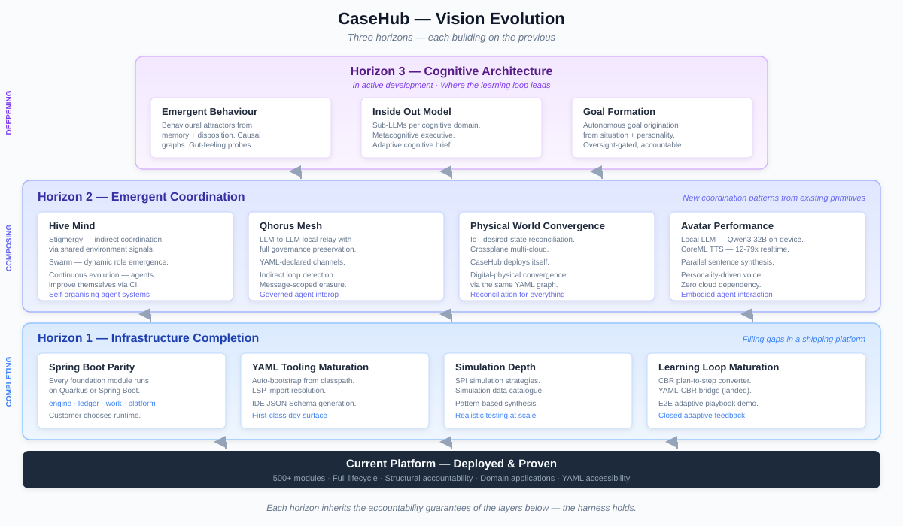

# CaseHub — The Accountable AI Harness

*Enterprise Automation, Coordination & Collaboration — Accountably — Through YAML.*

- AI agents that don't just execute — they reason, adapt, and leave a tamper-evident trail of every decision.
- Enterprise-class Java platform for AI-driven digital transformation.
- Accessible through YAML. Accountable by design.

---

## How to Read This Brief

The brief is layered. Start at the top; go deeper as interest
warrants.

| Layer | Title | Audience | What it covers |
|-------|-------|----------|----------------|
| **0** | Positioning | Everyone | Executive summary — differentiators, themes, market context. Most readers stop here. |
| **1** | Capability Areas | Technical leaders | What each area does, what makes it different, how deep it goes. |
| **2** | Applications | Domain experts | Six production-grade domain applications — what they do, how they use the platform, especially the AI/LLM parts. |
| **3** | Vision | Strategists | The trajectory — where the platform is heading, organised by maturity stage. |

---

## Layer 0 — Positioning

[**The Accountable AI Harness**](00-positioning.md) — tagline,
problem statement, key differentiators, 7 themes, platform
overview SVGs.

## Layer 1 — Capability Areas

| # | Area | Focus |
|---|------|-------|
| 1 | [The Declaration Surface](01-declaration-surface.md) | YAML, Java, and visual tools for expressing intent |
| 2 | [Agentic Orchestration](02-agentic-orchestration.md) | Patterns, speech acts, commitment store, fleet management |
| 3 | [AI Knowledge & Learning](03-ai-knowledge-learning.md) | Case-Based Reasoning, Retrieval-Augmented Generation, on-device inference, agent memory |
| 4 | [Enterprise Execution](04-enterprise-execution.md) | Blackboard, signal routing, worker dispatch, work queues |
| 5 | [Accountability & Governance](05-accountability-governance.md) | Merkle ledger, trust scoring, watchdogs, compliance |
| 6 | [Convergence & Situational Awareness](06-convergence-situational-awareness.md) | Desired-state reconciliation, ganglion evaluation |
| 7 | [Agent Identity & Cognition](07-agent-identity-cognition.md) | Structured identity, vocabulary matching, cognitive architecture |
| 8 | [The Shared Foundation](08-shared-foundation.md) | 178 modules, tenancy, simulation, fleet management |
| 9 | [The Application Surface](09-application-surface.md) | Pages framework, domain components, playbook engine |

**Appendix:** [YAML Walkthrough](01-yaml-walkthrough.md) — annotated
examples across the lifecycle.

## Layer 2 — Applications

[**The Application Portfolio**](10-applications.md) — AML, Clinical,
SOC, FSI Trading, DevTown, IoT. What each application does, how it
uses the platform, and what makes it interesting.

## Layer 3 — Vision

[**Where the Platform Is Heading**](23-vision.md) — three
horizons: completing, composing, deepening.

---

## Platform Overview

### Lifecycle Arc

### Architecture Stack

### Vision Evolution

