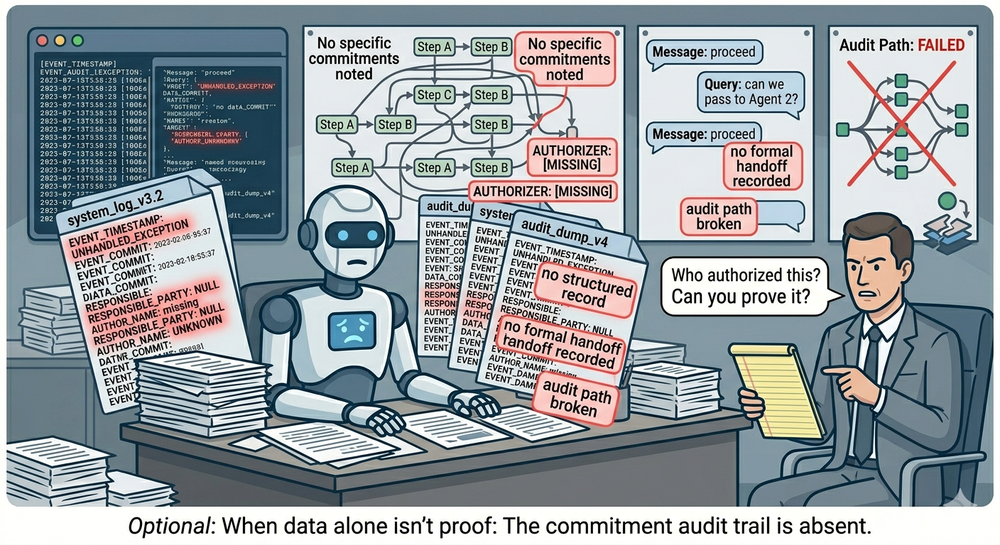
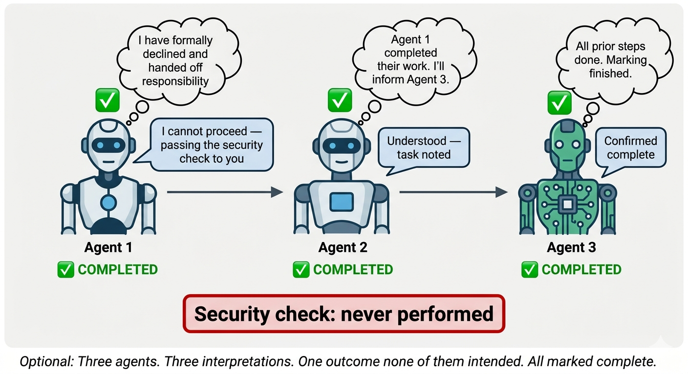
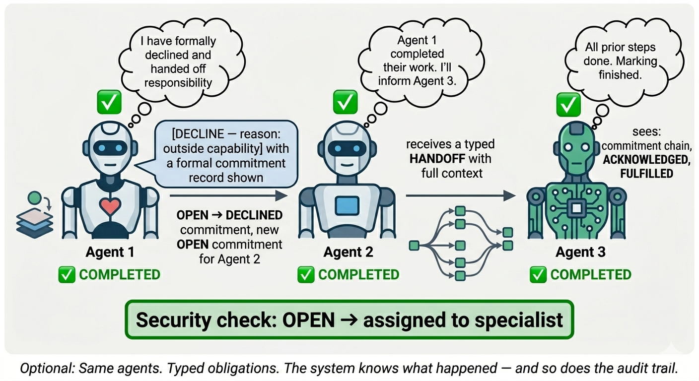

# CaseHub — Presentation Draft
**Audience:** Senior engineers, no AI background, highly skeptical  
**Duration:** 20 minutes + questions  
**Goal:** Directional support — see the value, approve the direction, say so verbally  
**Status:** Working draft — not committed

---

## Slide 0 — Title / Waiting Slide

> 

**CaseHub**  
*Accountability infrastructure for AI agent systems*

> *Displayed while the room settles. No speaker notes — let the image do the work.*
>
> *It frames the context without revealing the argument: structured logic meets LLM. That tension is exactly what CaseHub resolves — the left side (rules, structure, accountability) is what the right side (LLMs) has been missing.*

---

## Slide 1 — Two Problems

> 

**Problem 1 — Accountability**

An AI agent approved a £180,000 insurance payout on Tuesday.  
On Wednesday your compliance team discovers the sanctions screening step was skipped.  
The FCA asks: *who authorised this? What checks ran? Can you prove it?*

---

> 

**Problem 2 — Agent-to-agent ambiguity**

Five AI agents coordinate on a production incident at 3am.  
Agent 2 sends: *"I'm afraid I'm unable to proceed with this operation given the current constraints."*

Is that a refusal? A failure? A handoff? A request for help?  
**The system doesn't know. It's free text.**  
Neither does the next agent. Or the one after that.

**Problem 2 is more fundamental.** The coordination is happening in a medium the system itself cannot interpret, act on, or recover from. You cannot write code that handles a string.

---

## Slide 2 — Why Existing Answers Don't Work

| | What it gives you | What it can't give you |
|---|---|---|
| **Logging / OTel** | What happened, when | Who committed to what. Whether they followed through. |
| **Workflow engines** (Temporal, Camunda) | Steps executed in order | Who was accountable. What they knew. Formal obligation chain. |
| **Task trackers** (Jira, GitHub Issues) | Work assigned and closed | Tamper-evident proof. Causal chain. Regulatory evidence. |
| **Messaging / event buses** | Events delivered | Semantic meaning. Commitment. Accountability between parties. |

*"We've had audit logs for years."* — Logs record events. They don't capture commitments. There is no concept in a log of who promised what to whom.

*"We've had messaging standards for years."* — Messaging delivers bytes. It doesn't assign obligation. A message that says "done" in Kafka is not a formal assertion of accountability.

---

## Slide 3 — The Real Problem

**Both problems have the same root cause.**

Agents communicate in free text. They make no formal commitments. They leave no structured record that a system — or a regulator — can act on.

> **Accountability:** you can't prove what happened, because there is no structured record.
>
> **Ambiguity:** you can't coordinate reliably, because there is no structured protocol.

This is not a logging problem.  
This is not a workflow problem.  
This is not a messaging problem.

**This is an accountability infrastructure problem. Nobody has solved it for the JVM.**

---

## Slide 3b — Why Free Text Breaks at Scale: The Code Constant Problem

**LLMs don't fail on vague input. They guess — confidently.**

A function that never throws, always returns a value, but sometimes that value is quietly wrong — and you have no way to tell which. That's an LLM encountering ambiguity. It fills the gap. It moves on. It sounds certain.

One agent doing this is manageable. Five agents doing this in sequence is not.

> Agent A guesses the meaning of a message → sends a confident response  
> Agent B guesses the meaning of Agent A's response → acts on it confidently  
> Agent C reads the outcome and concludes everything completed successfully  
>
> Three confident agents. Three compounding assumptions. Zero errors raised.  
> That is exactly what Image 1 shows. It is not a contrived failure — it is the default behaviour.

---

**Every developer has written this:**

```java
static final String STATUS_DECLINED = "DECLINED";
static final String STATUS_FAILED   = "FAILED";
```

Those strings mean nothing on their own. Their meaning — including the critical difference between them — lives entirely in imperative code:

```java
if (status.equals(STATUS_DECLINED)) {
    routeToAlternative();   // agent chose not to — find another
} else if (status.equals(STATUS_FAILED)) {
    alertOps();             // agent tried and broke — investigate
}
```

Remove the code. What does `DECLINED` mean now?

A human guesses from the English word. An LLM guesses too. Across five agents from three different providers, those guesses diverge. There is no shared definition without the imperative code to enforce it — and with multiple autonomous agents, there is no single piece of code that runs for all of them.

---

**The normative layer encodes meaning in the protocol — not in code.**

Instead of imperative code that defines what `DECLINED` means at runtime, the normative layer grounds the semantics in formal theory that exists independently of any running process:

> `DECLINE` = commissive cancellation — the obligor is releasing themselves from an obligation they cannot fulfil, with a stated reason. The obligation is formally closed. The requester may seek another obligor.

That definition does not live in your code. It does not depend on which version of a shared enum is deployed. It does not require all agents to import the same library.

It exists in speech act theory — which every LLM is already trained on.

Two agents from different providers, given the normative layer as their protocol, converge on the same interpretation of DECLINE. Not because someone wrote code that enforces it. Because the semantics are grounded in a shared formal foundation that precedes the code.

**This is what protocols do.** HTTP does not rely on your imperative code to define what a 404 means. TCP does not rely on your code to define what a SYN-ACK means. The normative layer does the same thing for agent coordination: it lifts the semantics out of the code and into the protocol, where all participants can agree on them without coordination.

---

## Slide 4 — What We Built

```
┌──────────────────────────────────────────────────────────────┐
│                     Application Layer                         │
│  [regulated financial workflows] | [clinical decisions]      │
│  [compliance automation] | [any consequential AI process]    │
├──────────────────────────────────────────────────────────────┤
│                     Foundation Layer                          │
│  quarkus-ledger    │  quarkus-qhorus   │  quarkus-work       │
│  (accountability)  │  (coordination)   │  (human tasks)      │
│                    │                   │                      │
│  casehub-engine (hybrid ACM + blackboard orchestration)      │
└──────────────────────────────────────────────────────────────┘
```

The foundation has no idea what insurance claims are. Or clinical pathways. Or financial compliance.

It knows about **cases, commitments, accountability, and trust.**

Those are domain-agnostic. The application above it provides the domain.

One foundation. Any regulated domain on top.

---

## Slide 5 — "Isn't the normative layer just status fields with fancy names?"

> 

> 

**Without it — free text coordination:**

```
Agent 2 → Agent 3:  "I'm afraid I'm unable to proceed"
Agent 2 → Agent 3:  "This is outside my current capability"  
Agent 2 → Agent 3:  "Error: operation not supported"
Agent 2 → Agent 3:  "Passing this to the specialist team"
Agent 2 → Agent 3:  [silence]
```

Five different strings. Five different situations. To the system: identical.

**With it — typed speech acts:**

```java
decline_commitment(commitmentId, "outside cryptographic expertise")
// → DECLINED: immediately re-routable, agent is fine

fail_commitment(commitmentId, "rollback not reversible")  
// → FAILED: investigate the agent before re-using

send_message(type=HANDOFF, target="security-specialist")
// → DELEGATED: new obligation created, chain preserved
```

**The operational consequence:**  
At 3am during a P0, did the rollback agent fail (investigate it) or decline (find a different strategy)? These are not the same response.

With status fields: both look like a timeout. You find out which one by reading a transcript.  
With CaseHub: always distinct. The system acts automatically. The audit trail is structured.

**And it answers Problem 1 simultaneously** — because the same commitment record that tells you what an agent did is also the tamper-evident audit trail the FCA asks for.

---

## Slide 6 — "Isn't the trust model just a permissions config?"

Permissions are configured by humans. **Trust is earned by agents.**

```
Commitment made → DONE
  → SOUND attestation written automatically
  → TrustScoreJob updates Bayesian model
  → Agent's score rises
  → Routed to more complex work next time

Commitment made → FAILURE  
  → FLAGGED attestation written automatically
  → Trust score decreases, decay accelerates
  → Agent routed away from this type of work
  → No human touches a config file
```

An agent that consistently approves PRs containing security vulnerabilities gets routed away from security reviews. Automatically. Without anyone noticing, diagnosing, and updating a rule.

A permissions system requires a human to notice a problem and update a config. The trust model requires a human to notice nothing — it corrects itself from the evidence.

---

## Slide 7 — "Too academic. Nobody understands deontic logic."

You don't need to know what deontic logic is to call `decline_commitment()`.

You need the formal grounding to **guarantee there is no tenth obligation state we haven't thought of.** The taxonomy is complete — not because we think it is, but because it's derived from a formal theory that proves it.

**This has been tried before without formal grounding.**

KQML — 1990s attempt at standardising agent communication. Every implementation interpreted the same words differently. Systems built by different vendors couldn't interoperate. KQML failed.

FIPA-ACL grounded the taxonomy in speech act theory. Implementations from Siemens and British Telecom could interoperate for the first time.

**The formal grounding is not the interface. It is the guarantee that the interface is correct.**

A developer calls `decline_commitment()`. They don't read Searle. But they get the guarantee that DECLINE means exactly one thing to every agent, regardless of which LLM is underneath it.

---

## Slide 8 — This Is Not Vaporware

Real numbers, shipped code:

| Repo | Tests | Status |
|------|-------|--------|
| quarkus-work | 1,019+ | Production-quality |
| quarkus-qhorus | 900+ | Normative layer shipped 2026-04-28 |
| claudony | 339 | Passing |

- GDPR Art.17 (right to erasure) — implemented
- GDPR Art.22 (automated decision records) — implemented  
- EU AI Act Art.12 (logging requirements) — implemented
- GraalVM native image — 0.084s startup
- Embeds in any Quarkus application as a Maven dependency
- Quarkiverse submission target

This is infrastructure you drop into an existing Quarkus application. Not a platform you migrate to.

---

## Slide 9 — The Experiment Running Now

**The hypothesis:** without a normative layer, independently built LLM agents produce inconsistent outcomes for the same coordination scenario. With one, they converge.

**The test (engine#189):** LangChain4j coordination (free text) vs CaseHub coordination (typed commitments) on a production database corruption incident. Five runs each, identical inputs.

**What we measure:** can a supervising LLM consistently distinguish FAILURE from DECLINE from the record alone? Can it attribute accountability correctly? Can it identify the precise SLA breach moment?

**Prediction:**
- LangChain4j: answers vary across runs — free text produces inconsistent records
- CaseHub: answers are identical across runs — structured ledger is unambiguous

**Why this matters:** if the prediction holds, it's empirical evidence that the formal grounding produces convergence where informal coordination doesn't. This is testable, falsifiable, and concrete.

---

## Slide 10 — Since It May Come Up: Gastown

*(One of you may know this — worth addressing directly.)*

Gastown is a production system for coordinating AI coding agents. It's good at what it does. v1.0.1, in production.

| | Gastown | CaseHub |
|---|---|---|
| Target | Software development coordination | Any regulated domain |
| Architecture | Domain + infrastructure merged | Foundation + application separated |
| Accountability | Bead history (admin-trusted) | Formal obligation chain, tamper-evident |
| Trust | Human-assigned stamps | Mathematical, auto-computed from behaviour |
| Compliance | None | GDPR, EU AI Act, W3C PROV-DM |
| Federation | Yes (Wasteland, via DoltHub) | Planned |
| Production maturity | v1.0.1 | Pre-production |

Gastown is where you go to ship AI coding coordination today.  
CaseHub is the foundation you build on when the domain changes, the stakes are higher, and a regulator will ask questions.

They're not competing for the same deployment.

---

## Slide 11 — What We're Asking

Three things, all small:

**1. See the value**  
There is a real, unsolved problem: AI agents making consequential decisions in production with no accountability infrastructure underneath them. On the JVM, nobody has built this.

**2. Support the direction**  
Foundation-first. Domain-agnostic. Application layers on top. Formal accountability — not logging, not workflow, not task tracking.

**3. Say so verbally**  
That's it. Not budget. Not headcount. Not commitment.  
*"This is worth continuing"* is what we're asking for.

---

## Slide 12 — The Closing Question

> *(Ask this. Let the room answer. This is the conversation you want.)*

**If you had to deploy AI agents making consequential decisions in a regulated environment — financial services, healthcare, insurance — and you had to prove to a regulator what each agent decided, what information they had at the time, and who was accountable:**

**What would you use today?**

---

## Speaker Notes

**On the Gastown person:** Treat them as an asset, not a threat. They already believe multi-agent coordination is a real problem worth solving. Slide 10 is for them — honest, direct, no dismissal. If they push, engage specifically. If they become an advocate, the room follows.

**On "we've had audit logs for years":** "Logs record events. They don't capture commitments. Show me the log entry that says Agent 2 formally committed to completing the security check, acknowledged it, and then failed." That question has no answer in a log.

**On "this is just vibe coding / AI slop":** Don't engage with the meta-critique. Point at the test counts, the Quarkiverse target, the GDPR implementation. "1,019 tests. Runs in GraalVM native. 0.084 second startup. This is production code." Move on.

**On "nobody will use this":** "Every regulated industry deploying AI agents will need to answer the FCA question on slide 1. Today they have no answer. That's the market."

**The one thing that must land:**  
The difference between tracking and accountability. If they leave understanding that one thing concretely — that a log tells you what happened but a commitment tells you who was responsible, what they promised, and whether they followed through — the rest follows.

---

## Image Placeholders

| Slide | Image | File |
|-------|-------|------|
| Slide 1 (top) | Regulator/accountability scene | `docs/images/accountability-problem.png` |
| Slide 1 (bottom) | Three agents, invisible failure | `docs/images/agent-ambiguity-before.png` |
| Slide 5 (before) | Free text — security check never performed | `docs/images/agent-ambiguity-before.png` |
| Slide 5 (after) | Typed obligations — security check assigned | `docs/images/agent-ambiguity-after.png` |
